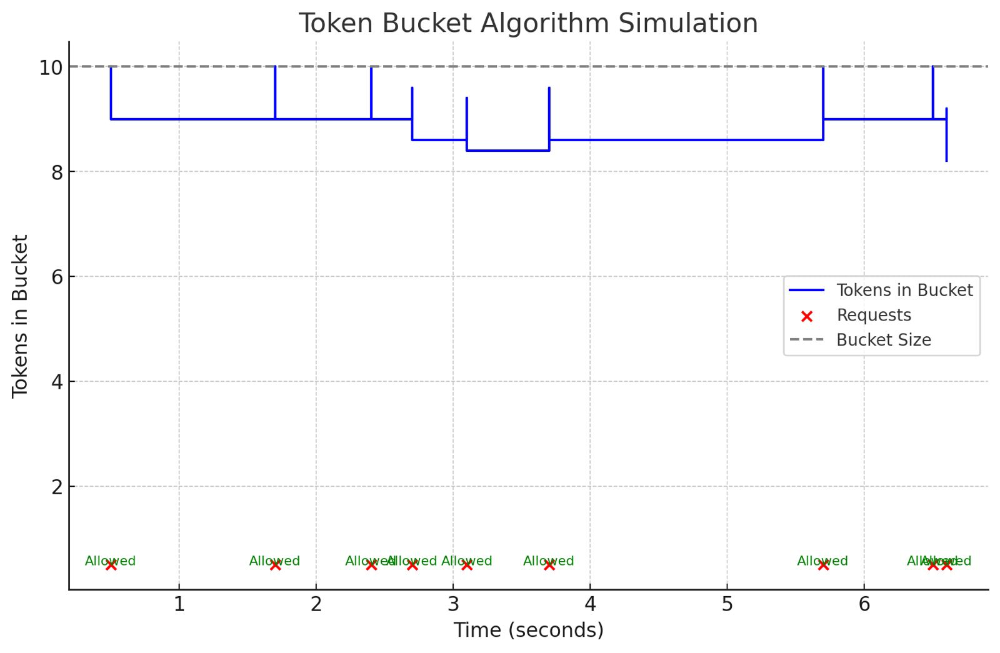

The chart above visually illustrates how the Token Bucket algorithm works:

Blue Line (Tokens in Bucket): Represents the number of tokens available over time. Tokens are added at a steady rate (refill rate) and capped by the bucket size.

Red Dots (Requests): Each red dot represents a request at a specific time.

Annotations (Allowed/Blocked): Indicates whether a request was successful ("Allowed") or rejected due to exceeding the rate limit ("Blocked").

Dashed Line (Bucket Size): Marks the maximum capacity of tokens the bucket can hold.

As requests come in, tokens are deducted (causing drops in the blue line).
